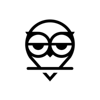
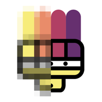

# Design-Training

some icons I designed ( or redesigned

## 2016-02-03 STLoadingGroup

Design for my [loading animation group](https://github.com/saitjr/STLoadingGroup).

   

   

## 2016-02-17-STShareTool

Design for my [share tool](https://github.com/saitjr/STShareTool.git).

## 2016-03-10-STAnimationTips

Design for my [animation tips demo](https://github.com/saitjr/STAnimationTips.git). And redesign from [Pail Saksin](https://dribbble.com/shots/1015204-Phone-box).

## 2016-03-11-Owl

Find on [dribbble](https://dribbble.com/shots/982204-Owl). Designed by [Paul Saksin](https://dribbble.com/ino).

My version :

## 2016-03-12-OwlRound

Find on [dribbble](https://dribbble.com/shots/685274-Owl). Designed by [Paul Saksin](https://dribbble.com/ino).

My version :

## 2016-03-12-MosicBrush

Designed by  [Gal Shir](https://dribbble.com/galshir) .

My version:

## 2016-03-12-KingElephant

Find on [dribbble](https://dribbble.com/shots/1782670-King-elephant). Designed by [Paul Saksin](https://dribbble.com/ino).

My version:

